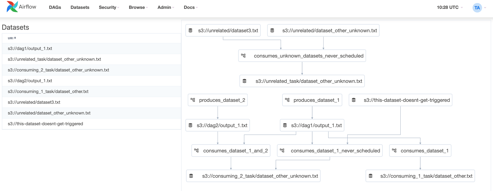

<style scoped>
h1 { line-height: 1.25; }
h1 + p {  margin: 0.5rem 0 1rem; }
</style>

# Datasets

*What it is, and how it was made*

**Tzu-ping Chung**<br>

<!--
Hello, my name is Tzu-ping, and I'm going to talk about datasets in Apache Airflow, and how our team designed and implemented
-->

---

## Me

- Call me TP ([uraunsjr.com](https://uraunsjr.com))
- Taipei, Taiwan
- [Astronomer](https://www.astronomer.io/)
    - Astro
    - Apache Airflow PMC
- Python packaging (pip & others)

<!--
As usual, here's a bit about myself. My name is close to impossible to pronounce unless you're a native Chinese speaker, so please just call me TP.

I live in Taipei, Taiwan, and currently work for Astronomer. I am responsible for designing and developing our Airflow as a Service called Astro. A part of my work is also to both contribute and maintain the Open Source Apache Airflow project.

I also maintain pip and contribute to other Python packaging projects as a member of the Python Packaging Authority, or PyPA.
-->

---

<style scoped>
blockquote > p {
    font-size: 125%;
    font-family: serif;
    font-style: italic;
    line-height: 2rem;
    padding: 0 0.4rem;
}
</style>

> [A] dataset is a stand-in for a logical grouping of data.
>
> Datasets may be updated by upstream “producer” tasks, and dataset updates contribute to scheduling downstream “consumer” DAGs.

---

# (A workflow with two downsteams)

---

## Existing solutions

- ~~`SubDagOperator`~~
- Giant DAG + task groups
- `TriggerDagRunOperator`

---

<style scoped>
section {
    display: grid;
    grid-template-columns: 500px 500px;
    grid-template-rows: 100% auto;
}
section > *:first-child { margin-right: 4px; }
section > *:last-child { margin-left: 4px; }
pre { margin-top: 0; }
</style>

```python
# Upstream DAG.

create = S3CreateObjectOperator(
    task_id="upload_data",
    s3_key=uri,
    data=transformed_data,
)

trigger = TriggerDagRunOperator(
    task_id="trigger_downstream",
    trigger_dag_id="use_data",
)

create >> trigger
```

```python
# Downstream DAG.

dag = DAG(
    dag_id="use_data",
    schedule=None,
)

@dag.task
def use_s3_data():
    hook = S3Hook()
    hook.download_file(uri, ...)
```

<!--
This works, but is suboptimal, due to poor separation of concerns.

The most significant issue being the difficulty to answer the question "When will the downstream DAG run?" by only looking at the downstream DAG.

It's also difficult to maintain multiple downstream DAGs because you need to both add a DAG, and then add an operator (plus the dependency). Two locations.
-->

---

# (Inlet/outlet between workflows)

---

<style scoped>
section {
    display: grid;
    grid-template-columns: 500px 500px;
    grid-template-rows: 100% auto;
}
section > *:first-child { margin-right: 4px; }
section > *:last-child { margin-left: 4px; }
pre { margin-top: 0; }
</style>

```python
# Upstream DAG.

from common import dataset

S3CreateObjectOperator(
    task_id="upload_data",
    s3_key=dataset.uri,
    data=transformed_data,    
    outlets=[dataset],
)
```

```python
# Downstream DAG.

from common import dataset

dag = DAG(
    dag_id="use_data",
    schedule=[dataset],
)

@dag.task
def use_s3_data():
    uri = dataset.uri
    h = S3Hook()
    h.download_file(uri, ...)
```

---

## AIP-48

- [Airflow Improvement Proposal](https://cwiki.apache.org/confluence/display/AIRFLOW/AIP-48+Data+Dependency+Management+and+Data+Driven+Scheduling)
- Data Dependency Management
- Data Driven Scheduling

<!-- The proposal consists of two parts: The interface, and the implementation. We already covered the interface; how about the implementation? -->

---

## Implementation

- Datasets are specialised [data lineage](https://airflow.apache.org/docs/apache-airflow/stable/administration-and-deployment/lineage.html)
- `DAG(schedule=...)` from [AIP-39](https://cwiki.apache.org/confluence/display/AIRFLOW/AIP-39+Richer+scheduler_interval)
- Scheduler needs to learn new tricks

---

## Data lineage

- Use existing `inlets` and `outlets`
- Datasets are compatible lineage objects
- Magic only happens in the scheduler

---

## Rich scheduling

---

<!-- _backgroundColor: white; -->



---

# Future work

- [External dataset inlets](https://github.com/apache/airflow/issues/29162)
- [Dynamic lineage expansion](https://github.com/apache/airflow/issues/28304)
- [Multi-paradigm DAG scheduling](https://airflow.apache.org/docs/apache-airflow/stable/authoring-and-scheduling/datasets.html#notes-on-schedules)

---

# Questions?
